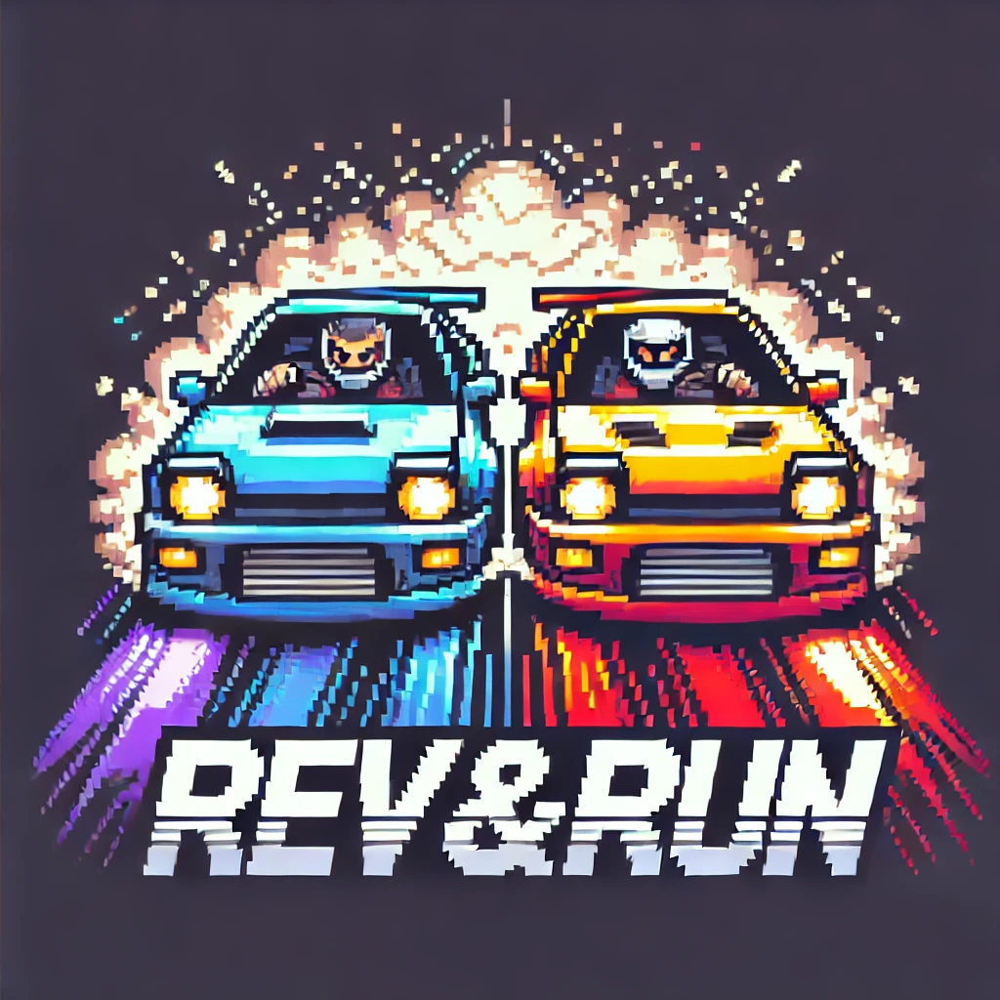
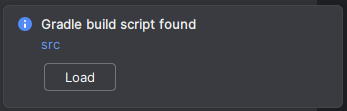
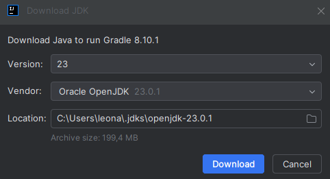
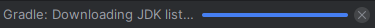
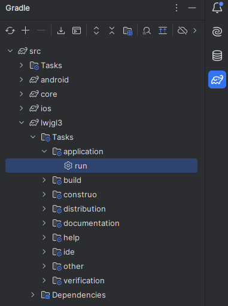
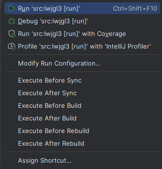

# Rev & Run
<p align="center">
    
</p>

Rev & Run is a racing game developed by [Ferran Sogas Linares](https://github.com/ferransogas) and [Leonardo Ruben Edenak Chouev](https://github.com/leonhrt) for the Software Test and Quality subject at the Universitat Autonoma de Barcelona.

The game features a 2D cenital view with a random closed track generation and realistic physics in component degradation and degradation, and multiple attributes to each component of the car, it also simulates the real grip of a car, having in mind it's current durability.

The game can be played in:
* PC (Windows, Linux and Mac)
* Android
* iOS

**Disclaimer:** Currently the game does not support the input for Android and iOS, but we plan to implement it soon.

## Index
- [Prerequisites](#prerequisites)
    - [IntelliJ IDEA](#intellij-idea)
    - [Alternatives](#alternatives)
- [Project Setup](#project-setup)
    - [1. Clone the repository](#1-clone-the-repository)
    - [2. Open the project in IntelliJ](#2-open-the-project-in-intellij)
    - [3. Run the game](#3-run-the-game)
- [Project Structure](#project-structure)

## Prerequisites
### IntelliJ IDEA
The game was developed using Intellij IDEA, it is recommended to execute the project from Intellij.
* Download and install IntelliJ IDEA from the [JetBrains official website](https://www.jetbrains.com/idea/download/)

### Alternatives
**Disclaimer**: We have only run the project in Intellij, we haven't tested if it would run in any other IDE.

If you prefer another IDE, check the [LibGDX documentation](https://libgdx.com/wiki/start/setup) to learn how to run the porject in other IDEs as:
* Eclipse
* Android Studio 
* Other IDEs

## Project Setup

### 1. Clone the repository:
```bash
git clone https://github.com/leonhrt/rev-n-run.git
```

### 2. Open the project in IntelliJ:
* File → Open → [Select project directory]
* In the bottom right of the screen should appear a popup saying "Gradle build script found" with a "Load" button, click the "Load" button:

    

* If you don't have a JDK installed or is your first time using Intellij, will appear a window to download a JDK, just click Download, otherwise, configure the JDK as you want if you already have a JDK installed in yout system (not recommended):
    
* Wait for gradle to load the project and the JDK to be downloaded (In the bottom right you will have a the current status of any process running. If there's nothing, the nothing is running in the background):
    

### 3. Run the game:
* Once everything is loaded, on the right bar of the IDE, click the elephant button, navigate to: `src/lwjgl3/Tasks/application`:
    
    
* Right click the `run` and click `Run 'src:lwjgl3 [run]'`
    
    
* Wait for the project to be builded and a window should appear to play the game.
* Enjoy!


## Project Structure
The structure of the project can be complex, but we will be prompting where the code and the test code is located.
```
rev-n-run/
├── .github/
│   ├── scripts/
│   │   ├── java-style-checker.sh
│   ├── test-workflows/
│   │   ├── Test.java (to test checkstyle, doesn't contain any test)
│   ├── workflows/
│   │   ├── style-check.yml
├── ...
├── src/
│   ├── android/
│   │   ├── ...
│   ├── assets/
│   │   ├── ...
│   ├── core/
│   │   ├── src/
│   │   │   ├── main/java/io/github/revNrun/
│   │   │   │   ├── controllers/
│   │   │   │   ├── model/
│   │   │   │   ├── view/
│   │   │   │   ├── Main.java
│   │   │   │
│   │   │   ├── test/java/io/github/revNrun/
│   │   │   │   ├── controllers/
│   │   │   │   ├── model/
│   │   │   │   ├── view/
│   │   │   ├── build.gradle
│   ├── gradle/
│   │   ├── ...
│   ├── ios/
│   │   ├── ...
│   ├── lwjgl3/
│   │   ├── ...
│   ├── ...
├── ...
```